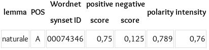
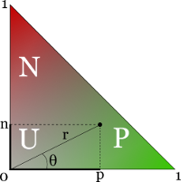
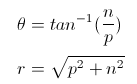
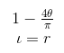

# WAAT-2020
Repository del Corso WAAT AA-2019-20

## Setup NLTK


1. Aprire la console di Python e digitare i seguenti comandi:
    
    ```python
    
        import nltk
        print(nltk.__version__) # per verificare la versione (3.4.5 in uso)
        nltk.download() # o nltk.download_gui() in caso di errore
    ```

2. Scaricare la collection _book_ dalla GUI, in caso non si riesca a visualizzare la GUI scaricare direttamente 
la collection con il seguente comando:

    ```python
    
        import nltk
        nltk.download('book') 
    ```
    
## Esercizio 1

Recuperare tutti gli aggettivi presenti nelle prime pagine dei seguenti siti:

- https://www.economist.com/
- https://www.ft.com/

Effettuare l’analisi seguendo i seguenti passi:

1. Estrarre il contenuto testuale dalle pagine web
2. Tokenizzare il testo ottenuto
3. Eliminare le stop words
4. Filtrare solo le parole di senso compiuto
5. Taggare i singoli token utilizzando un tagger
6. Filtrare solo quei token taggati come aggettivi


## Esercizio 2

Creare un *analizzatore di sentiment* in grado di determinare il _sentiment_ di un testo in italiano.

### TWITA lexicon
Per calcolare il _sentiment_ utilizziamo il progetto [TWITA](http://valeriobasile.github.io/twita/sentix.html) che 
contiene un _lexicon_ (nel file sentiment/sentix.csv del branch attuale) con tutte le parole italiane a cui è associato 
un determinato livello di sentiment.

Ogni riga del file sentix.csv contiene una parola italiana, part-of-speech (nome, verbo, aggettivo, avverbio), 
WordNet synset ID, un punteggio positivo e negativo preso da [SentiWordNet](http://sentiwordnet.isti.cnr.it/), 
un range di polarità tra 1 e -1 e una intensità tra 0 e -1. Ecco un esempio:



#### Polarità ed intensità

La polarità e l'intensità si riferisco ai vari synset associati ad una parola. Se consideriamo un piano cartesiano
in cui l'asse _x_ rappresenta i punteggio positivo e l'asse _y_ quello negativo di un determinato lemma, allora per tutti 
i synset associati a quel lemma, il sentiment sarà confinato nel triangolo in figura (la somma di sentiment positivo e negativo è 1).



Quindi polarità e intensità sono calcolati come:





Queste due misure sono utili tutte le volte possiamo associare un sysnset ad un determinato lemma (disambiguazione)
per ottenere un calcolo del sentiment più accurato.

### Sentiment analysis

Utilizzando il lexicon _sentix.csv_ analizzare le frasi contenute nel libri di Grazie Deledda e Luigi Pirandello
per confrontare il sentiment espresso dai due autori. Per semplicità:

- Filtrare stopwords e punteggiatura
- Considerare solo le 500 parole più utlizzate da un autore
- Per ogni parora utilizzare _sentix_ per determinare il _sentiment score_ (positivo e negativo) di tutti i synset associati alla
parola cercata calcorare il sentiment della parola come somma dei _sentiment score_ dei synset.

Ad esempio, cercando per la parola *naturale* da _sentix_ si ottengono  seguenti valori:


| lemma    | pos | sysnsetID | negative | positive | polarity  | intensity |
|----------|-----|-----------|----------|----------|-----------|-----------|
| naturale | a   | 74346     | 0.750    | 0.125    | 0.789726  | 0.760345  |
| naturale | a   | 74594     | 0.250    | 0.000    | 1.000000  | 0.250000  |
| naturale | a   | 1406180   | 0.000    | 0.125    | -1.000000 | 0.125000  |
| naturale | a   | 1407909   | 0.000    | 0.250    | -1.000000 | 0.250000  |
| naturale | a   | 1569965   | 0.250    | 0.000    | 1.000000  | 0.250000  |
| naturale | a   | 1569965   | 0.250    | 0.000    | 1.000000  | 0.250000  |
| naturale | a   | 1570892   | 0.000    | 0.625    | -1.000000 | 0.625000  |
| naturale | a   | 1574036   | 0.125    | 0.375    | -0.590334 | 0.395285  |
| naturale | a   | 1577771   | 0.125    | 0.375    | -0.590334 | 0.395285  |
| naturale | a   | 1595050   | 0.125    | 0.375    | -0.590334 | 0.395285  |

Se per ogni riga calcoliamo (_positive_ - _negative_) e sommiamo il totale, otteniamo *0.375*. 
