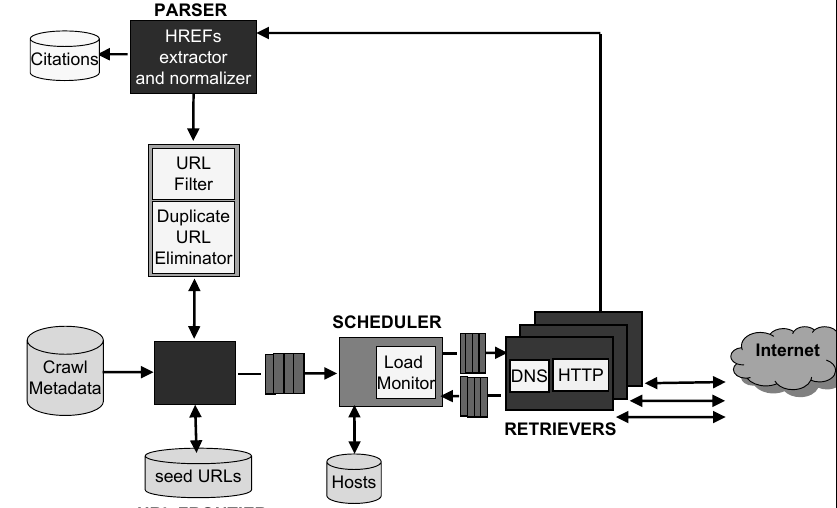

# WAAT-2020


## Esercitazione 4

Sfruttare la libreria BeautifulSoup e NetworkX per implementare una versione semplificata di un crawler e del PageRank


### Esercizio 1

La prima pagina web mai pubblicata si trova all'indirizzo *http://info.cern.ch/hypertext/WWW/TheProject.html*.
Utilizzare Beautifulsoup per fare il crawling del web _primordiale_, utilizzando una ricerca di tipo Breadth-First con una profondità
massima pari a 2. Ottenere un elenco di pagine a cui sono associate le pagine collegate.

Esempio di utilizzo di Beautiful soup:
```python
import requests
from bs4 import BeautifulSoup

page = requests.get('http://info.cern.ch/hypertext/WWW/TheProject.html').text
soup = BeautifulSoup(page, "html.parser")

```
Architettura generale di un crawler:



### Esercizio 2

Partendo dalla pagina iniziale *http://info.cern.ch/hypertext/WWW/TheProject.html* recuperare la _rete_ ottenuta nell'esercizio precedente per calcolare il PageRank delle pagine. 

Per calcolare il PageRank utlizzare la libreria *networkx*. Ad esempio calcolando il PageRank della seguente rete:


si ottiene
- 'A': 0.155
- 'B': 0.281
- 'C': 0.276
- 'D': 0.281

Esempio:
```python
    import networkx as nx
    import matplotlib.pyplot as plt
    web = nx.DiGraph()
    web.add_edges_from([
        ('A', 'B'),
        ('B', 'D'),
        ('D', 'C'),
        ('C', 'B'),
        ('C', 'A'),
    ])
    pos = nx.circular_layout(web)
    nx.draw(web, with_labels=True, pos=pos)
    plt.show()
    print(nx.pagerank(web))
```

### Esercizio 3

Utilizzare il modello vettoriale con pesatura dei termini TF-IDF su tutte le pagine ottenute dal crawler definito nei punti precedenti, limitando la massima profondità a 2.
Ottenere la lista ordinata dei risultati per la query "World-Wide Web":

1. Ordinando i risultati con la cosine similarity
2. Ordinando i risultati con il pageRank
3. Ordinando i risultati con il cosine similarity + pageRank (ovvero a parità di CS ordinare per PR)
